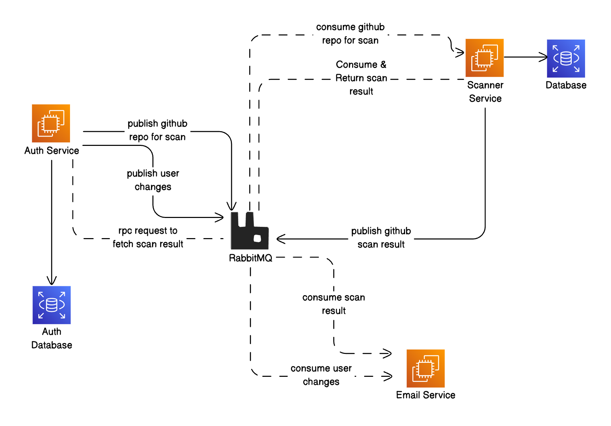

# Overview
`RepoScanner` is a project composed of three microservices that work together to authenticate users, scan GitHub repositories, and send notifications based on scan results. This setup enables secure access control, automated scanning, and email notifications to streamline repository management and security analysis.

# Diagram


## Table of Contents

- [Prerequisites](#prerequisites)
- [Microservices Overview](#microservices-overview)
- [Docker Compose Setup](#docker-compose-setup)
  - [Prerequisites](#1-prerequisites)
  - [Environment Configuration](#2-environment-configuration)
  - [Docker compose command](#3-docker-compose-command)
  - [Access](#4-access)
- [Setup Instructions](#setup-instructions)
  - [Clone the Repository](#1-clone-the-repository)
  - [Auth Service](#2-auth-service)
  - [Scan Service](#3-scan-service)
  - [Email Service](#4-email-service)
- [Usage](#usage)
- [Contributing](#contributing)

## Prerequisites

Before setting up the project locally, ensure the following are installed on your local machine:

- **[Trivy](https://aquasecurity.github.io/trivy/v0.18.3/installation/)**: A vulnerability scanner for containers and other artifacts, required to perform security scans.

## Microservices Overview

1. **Auth Service** - Developed using **NestJS**, this service handles user authentication and provides JWT tokens for secure access to other services.
2. **Scan Service** - Built with **Golang**, this service is responsible for scanning GitHub repositories using Trivy. It communicates with the Auth and Email services to perform secure scans and notify users of the results.
3. **Email Service** - Another **NestJS** service, this service sends email notifications based on scan results, utilizing the results from the Scan Service.

## Docker Compose Setup

### 1. Prerequisites
- Ensure Docker and Docker Compose are installed on your system
- Clone the repository: `git clone https://github.com/jobayer12/repoScanner.git`
- Navigate to project root: `cd repoScanner`

### 2. Environment Configuration
- Rename `.env.sample` to `.env` in root directory
- Set the following Email Service Configuration in `.env`:
  ```dotenv
    MAIL_HOST=your_smtp_host
    MAIL_PORT=your_smtp_port
    MAIL_USERNAME=your_smtp_username
    MAIL_PASSWORD=your_smtp_password
    MAIL_DEFAULT_FROM=sender_email@example.com
  ```
### 3. Docker compose command

```shell
  # Start all services
  docker-compose up -d
```

### 4. Access

Swagger UI: http://localhost:3000/api

Login Credentials:
- Email: john.doe@example.com
- Password: v0N6OI8

#### Important Notes
- Ensure all .env files are properly configured
- Valid mail credentials are crucial for email service functionality


## Setup Instructions for setup locally

### Clone the Repository
To get started, clone the repoScanner repository to your local machine:
  ```bash
  git clone https://github.com/jobayer12/repoScanner.git
  cd repoScanner
  ```


### 2. Auth Service

The Auth Service handles user registration, login, and JWT authentication.


#### Steps to Set Up

- Navigate to the `auth-service` directory:

   ```bash
   cd auth-service
   ```

- Rename `.env.sample` to `.env` and configure the environment variables.

- Install the dependencies:
   ```bash
   npm install
   ```
- Start the Auth Service:
   ```bash
   npm run start
   ```

### 3. Scan Service

The Scan Service performs repository scans using Trivy.

#### Steps to Set Up

- Navigate to the `scan-service` directory:

   ```bash
   cd scan-service
   ```
- Rename `.env.sample` to `.env` and configure any necessary environment variables.


- Install any required Go dependencies:
    ```bash
    go mod download
    ```

- Start the Scan Service:
    ```bash
    make run
    ```

### 4. Email Service
The Email Service handles email notifications, alerting users based on scan results.

#### Steps to Set Up

- Navigate to the email-service directory:

    ```bash
    cd email-service
    ```
- Rename `.env.sample` to `.env` and configure any necessary environment variables.

- Install the dependencies:
    ```bash
    npm install
    ```
- Start the Email Service:
    ```bash
    npm run start
    ```

## Usage

- Go to http://localhost:3000/api#/ to see the list of available Auth Service endpoints.

- Use the pre-created user:
  -	Email: john.doe@example.com
  -	Password: v0N6OI8

- Log in to retrieve a JWT token, which can then be used to authorize requests to the services.

- **Perform a Scan:** Send a scan request through the Scan Service using the JWT token from the Auth Service.
- **Receive Email Notification:** Once a scan completes, the Email Service will automatically send a notification based on the results.


## Contributing
Contributions are welcome! Please fork the repository and create a pull request for review.